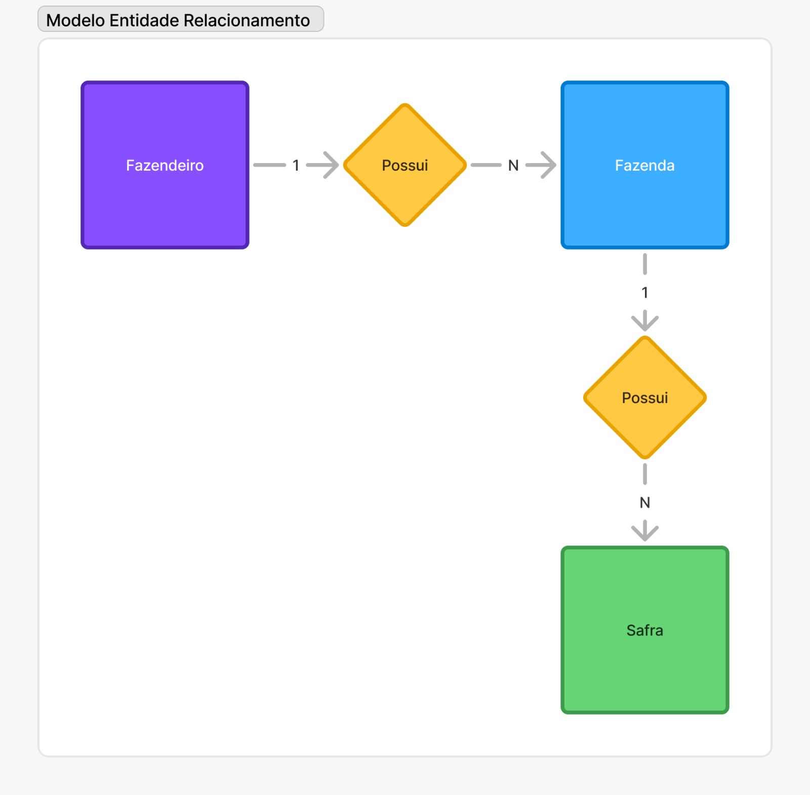
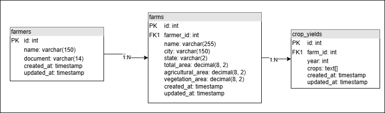

# Banco de Dados

Este documento é dedicado para esclarecer informações perinentes ao banco de
dados.

Este documento diz a respeito sobre:

- Especificações
- Conexão
- Migrações
- Entidade relacionamento

# Especificações

Este projeto faz uso de um banco de dados PostgreSQL para gerenciamento dos
dados.

A versão do banco de dados para distribuição/desenvolvimento deste projeto é a
**15**.

# Conexão

Para fazer com que este projeto se conecte ao banco de dados que será dedicado a
ele é preciso preencher as variáveis de ambiente relacionadas.

Abaixo está uma tabela das variáveis que precisam ser preenchidas para que a
conexão com o banco de dados seja feita com êxito:

| Nome                | Descrição                                                   | Obrigatório |
| ------------------- | ----------------------------------------------------------- | ----------- |
| `DATABASE_HOST`     | Host do banco de dados (ex: `localhost`)                    | ✅           |
| `DATABASE_PORT`     | Porta do banco de dados (ex: `5432`)                        | ✅           |
| `POSTGRES_USER`     | Usuário do PostgreSQL (ex: `postgres`)                      | ✅           |
| `POSTGRES_PASSWORD` | Senha do usuário do PostgreSQL (ex: `postgres`)             | ✅           |
| `POSTGRES_DB`       | Nome do banco de dados utilizado pelo projeto (ex: `myapp`) | ✅           |

# Migrações

Este projeto faz uso de um ORM (object relational mapping) chamado TypeORM. Esta
ferramenta nos proporciona o uso de *migrations* no projeto.

Para executar as migrations no ambiente de desenvolvimento utilize o comando
registrado no `package.json`. Rode o comando na raiz do projeto:

```bash
pnpm migration:run
```

Este comando vai rodar as migrações e assim sincronizar o banco de dados e
preparar ele para uso.

# Entidade Relacionamento

O banco de dados deste sistema foi modelado para resolver um problema do mundo
real: gerenciar o cadastro de produtores rurais.

Abaixo está um diagrama entidade-relaciomento para uma melhor visualização:



## Entidades

Abaixo está listado as entidades do sistema e uma descrição breve do que elas
representam no mundo real.

### Fazendeiros

Fazendeiros são os agricultores, proprietários de múltiplas fazendas.

### Fazendas

Fazendas são propriedades de apenas 1 fazendeiro, não há fazendas com múltiplos
donos. Uma fazenda pode ter uma ou mais safras de acordo com o que foi colhido
ao longo dos anos.

### Safras

As safras são colhidas em diferentes anos por fazendeiros, em suas propriedades.
As safras podem ter muitas culturas, essas culturas são armazenadas diretamente
como atributos.

# Modelo lógico

Abaixo define o modelo lógico do banco de dados para este sistema:


